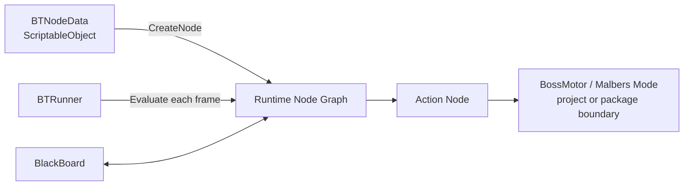
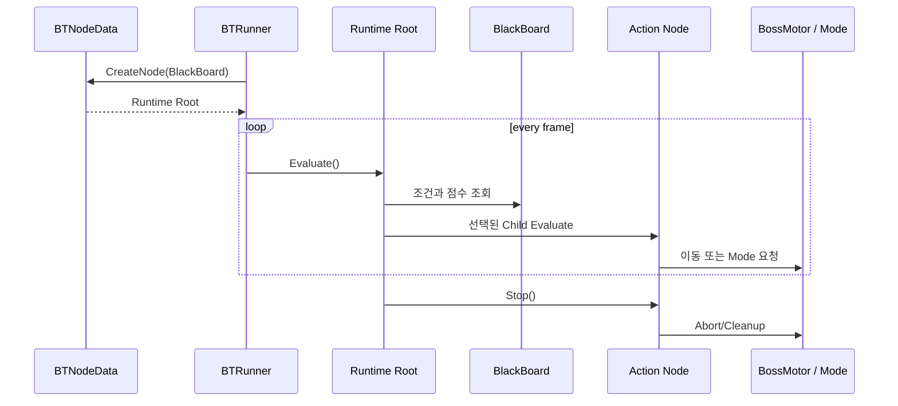

# Custom Behavior Tree + Utility AI

[← 이전: Runtime Building](../RuntimeBuildingSystem/README.md) · [시스템 목록](../README.md) · [저장소 홈](../../README.md) · [Source Map](./Source/README.md) · [Review Guide](../../docs/REVIEW_GUIDE.md) · [Architecture](../../docs/ARCHITECTURE.md) · [다음: Boss Combat →](../BossCombatFramework/README.md)

보스 AI에서 **조건·순서를 표현하는 Behavior Tree**와 **상황별 적합도를 비교하는 Utility 선택**을 함께 사용하기 위해 구현한 Runtime Node 구조입니다.

## 해결하려는 문제

### 1. 정상 종료와 강제 중단의 구분

실행 중인 행동이 다른 행동이나 Phase 전환 때문에 중단될 때, 이동 Agent·Animation Mode·Coroutine·Root Motion 설정이 남을 수 있습니다.

```text
정상 실행:
OnStart
→ OnUpdate
→ SUCCESS / FAILURE
→ OnStop

강제 중단:
Stop
→ OnAbort
→ OnStop
```

모든 Runtime Node가 같은 수명주기 계약을 사용하므로 Composite와 외부 System이 실행 중인 행동을 일관되게 정리할 수 있습니다.

### 2. Stateful와 Reactive 실행 방식 분리

| Node | 동작 | 사용 목적 |
|---|---|---|
| `Sequence` | 실행 중인 Child Index를 기억 | 여러 단계를 순서대로 이어서 수행 |
| `ReactiveSequenceNode` | 매 Tick 첫 조건부터 재검사 | 앞선 조건 변화에 즉시 반응 |
| `Selector` | 우선순위가 높은 실행 가능 Child 선택 | 조건 기반 행동 선택 |
| `UtilitySelectorNode` | Scorer 점수가 가장 높은 Child 선택 | 상황별 적합도 기반 선택 |

### 3. 행동 전환 Thrashing 억제

`UtilitySelectorNode`는 매 Frame 무조건 행동을 교체하지 않습니다.

```text
현재 Action 실행
→ CanInterrupt() 확인
→ reEvaluationInterval 경과
→ 모든 Entry Score 계산
→ 현재 Action에 inertiaBonus
→ 더 높은 다른 Action이면 기존 Node Stop
→ 새 Action Evaluate
```

### 4. Editor Data와 Runtime 상태 분리



ScriptableObject는 Tree 정의를 보관하고, `started`, 현재 Child, Timer, Active Action 같은 실행 상태는 Runtime Node Instance가 가집니다.

---

## 먼저 볼 파일

| 순서 | 파일 | 확인할 내용 |
|---:|---|---|
| 1 | [`Node.cs`](./Source/Core/Node.cs) | 공통 `Evaluate`, `Stop`, `OnAbort` 수명주기 |
| 2 | [`BTRunner.cs`](./Source/Core/BTRunner.cs) | ScriptableObject Data에서 Root 생성 후 매 Frame Tick |
| 3 | [`Sequence.cs`](./Source/Composite/Sequence.cs)와 [`ReactiveSequenceNode.cs`](./Source/Composite/ReactiveSequenceNode.cs) | Stateful와 Reactive의 차이 |
| 4 | [`UtilitySelectorNode.cs`](./Source/Composite/UtilitySelectorNode.cs) | 재평가, Interrupt, 관성 Bonus, 최댓값 선택 |
| 5 | [`BlackBoard.cs`](./Source/Core/BlackBoard.cs) | 타입별 공유 Data와 Action Cancel Event |
| 6 | [`ActionJumpAttackNode.cs`](./Source/ExampleActions/ActionJumpAttackNode.cs) | 예측 착지, Animation 동기화, NavMesh 보정, Cleanup |

5분만 검토한다면 **1 → 4 → 6** 순서가 가장 핵심적입니다.

---

## Runtime 흐름



---

## Blackboard

`BlackBoard`는 `Animator.StringToHash` 또는 `BlackboardKey`를 사용해 Key를 정수화하고, 타입별 Dictionary에 값을 저장합니다.

| Data | 저장소 |
|---|---|
| `int` | `Dictionary<int, int>` |
| `float` | `Dictionary<int, float>` |
| `bool` | `Dictionary<int, bool>` |
| `Vector3` | `Dictionary<int, Vector3>` |
| Object Reference | `Dictionary<int, object>` |

대표 코드:

- [`BlackBoard.cs`](./Source/Core/BlackBoard.cs)
- [`BlackboardKey.cs`](./Source/Core/BlackboardKey.cs)

---

## Utility Scoring

| 파일 | 역할 |
|---|---|
| [`WeightScorer.cs`](./Source/Scoring/WeightScorer.cs) | 단일 Score 계약 |
| [`GenericFloatScorer.cs`](./Source/Scoring/GenericFloatScorer.cs) | Blackboard Float 기반 Score 예시 |
| [`CompositeScorer.cs`](./Source/Scoring/CompositeScorer.cs) | 여러 Score의 합·곱·평균·최댓값·선형 결합 |
| [`UtilitySelectorData.cs`](./Source/Data/UtilitySelectorData.cs) | Entry, 재평가 주기, 관성 Bonus Data |
| [`UtilitySelectorNode.cs`](./Source/Composite/UtilitySelectorNode.cs) | Runtime 선택과 Action 교체 |

---

## 실제 Action 연동 예시

| 파일 | 역할 |
|---|---|
| [`ActionMoveNode.cs`](./Source/ExampleActions/ActionMoveNode.cs) | 목표 이동 요청 |
| [`ActionAttackNode.cs`](./Source/ExampleActions/ActionAttackNode.cs) | Attack Mode 실행과 완료 대기 |
| [`ActionJumpAttackNode.cs`](./Source/ExampleActions/ActionJumpAttackNode.cs) | Player 이동 예측, 점프 궤적, 착지·외부 상태 복원 |

`ActionJumpAttackNode`는 외부 Controller 설정을 직접 변경하기 때문에 `OnStop`에서 Animator Speed, Root Motion, Gravity, Grounded, Position/Rotation 제어를 원상복구합니다.

---

## Source 폴더 지도

| 폴더 | 책임 |
|---|---|
| [`Source/Core`](./Source/Core/) | Node, Runner, Blackboard, Node Data 계약 |
| [`Source/Composite`](./Source/Composite/) | Selector, Sequence, Reactive, Utility와 보조 Composite |
| [`Source/Data`](./Source/Data/) | ScriptableObject Tree Data |
| [`Source/Scoring`](./Source/Scoring/) | Utility Score 계약과 조합 |
| [`Source/ExampleActions`](./Source/ExampleActions/) | Project 연동 Action 예시 |

파일별 지도는 [`Source/README.md`](./Source/README.md)에 있습니다.

---

## 공개본 경계

다음 타입은 원본 Project 또는 외부 Package에 남아 있습니다.

- `BossMotor`
- `ActionPlayMode`
- 행동별 Data 일부
- 구체 거리·HP·Cooldown Scorer
- Malbers `MAnimal`, `MAnimalAIControl`, Mode
- Blackboard Sensor와 실제 Boss Prefab 구성

공개본의 검토 대상은 완성된 범용 Package가 아니라, **보스 행동 선택을 위해 설계한 Runtime Node 수명주기와 Utility 결합 방식**입니다.

---

[← Runtime Building](../RuntimeBuildingSystem/README.md) · [Source Map](./Source/README.md) · [다음: Boss Combat Framework →](../BossCombatFramework/README.md)
