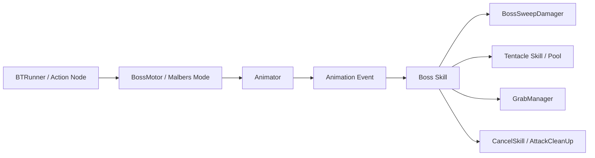
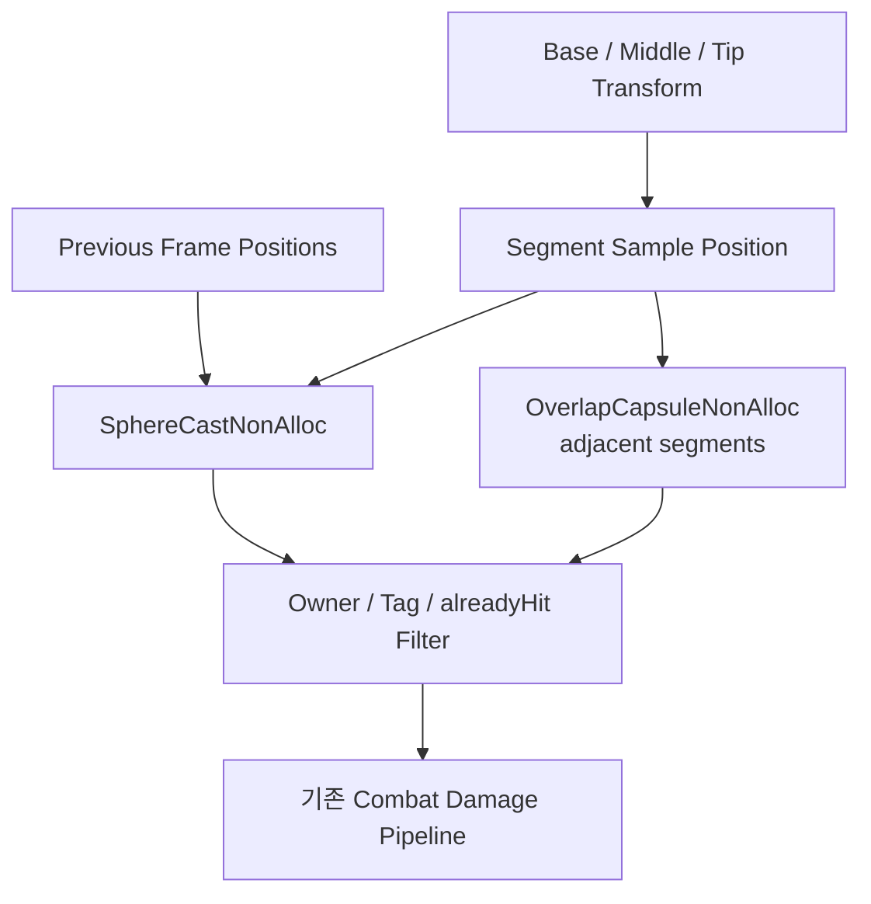
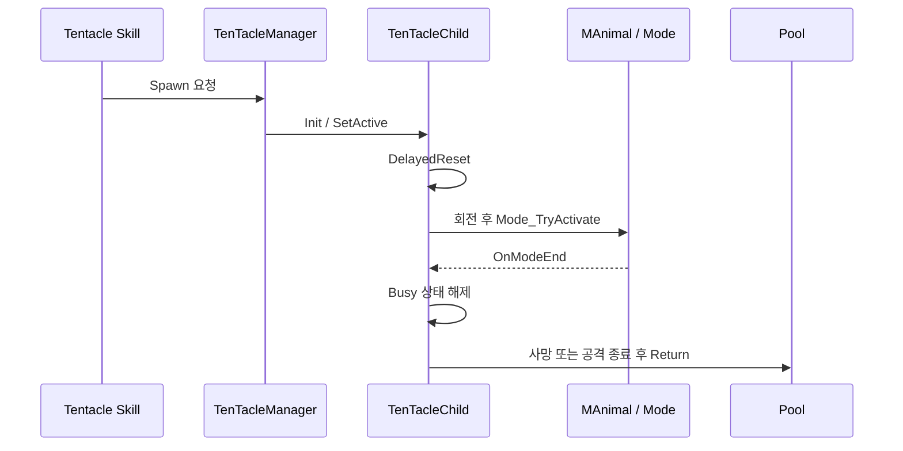

# Boss Combat Framework

[← 이전: Behavior Tree](../BehaviorTreeUtilityAI/README.md) · [시스템 목록](../README.md) · [저장소 홈](../../README.md) · [Source Map](./Source/README.md) · [Review Guide](../../docs/REVIEW_GUIDE.md) · [Architecture](../../docs/ARCHITECTURE.md) · [Dependencies](../../docs/DEPENDENCIES.md)

보스의 빠른 골격 공격 판정, 다단계 Skill, Phase 전환, 촉수 개체의 생성·공격·사망·Pool 복귀와 잡기 흐름을 보여 주는 코드 스냅샷입니다.

## 해결하려는 문제

### 1. 빠른 공격의 Frame 사이 피격 누락

현재 Frame의 Collider만 검사하면 공격 Bone이 이전 위치와 현재 위치 사이를 빠르게 이동할 때 대상 위를 건너뛸 수 있습니다.

`BossSweepDamager`는 두 방향으로 빈 공간을 채웁니다.

```text
시간축
각 Segment의 Previous Position
→ Current Position
→ SphereCastNonAlloc

공간축
현재 Frame의 인접 Segment
→ OverlapCapsuleNonAlloc
```

검출된 Collider는 공격 창 단위 `HashSet<Collider>`에 기록하여 같은 Collider에 중복 피해를 전달하지 않습니다.

### 2. 복합 Skill의 실행과 취소

Skill은 한 번의 메서드로 끝나지 않고 Telegraph, 생성, 확대, 장착, Animation Trigger, Damage, Cleanup 단계로 이어집니다.

```text
BT Action
→ Boss Mode
→ Animation Event
→ Execute_* Skill Stage
→ Damage / Projectile / Spawn
→ AttackCleanUp 또는 CancelSkill
```

`TreeStrikeYC`는 생성 Object와 Coroutine의 소유자를 Skill로 유지하고, 취소 시 Coroutine을 중단한 뒤 생성 Object와 Effect 상태를 정리합니다.

### 3. Pooling된 촉수의 잔존 상태

Pool에서 재사용되는 촉수에는 이전 실행의 HP, Animator, Controller State, Listener, Coroutine과 Busy Flag가 남을 수 있습니다.

```text
OnEnable
→ Mode End Listener 등록
→ 한 Frame 뒤 HP / Animator / Controller Reset

OnDisable
→ Listener 해제
→ Coroutine 중단
→ isAttacking 초기화
→ AutonomousTentacle Spawn 상태 초기화
```

### 4. Phase 전환 Cleanup

`YeogChunPhaseManager`는 Phase 조건이 만족되면 다음 작업을 하나의 전환 경로에서 실행합니다.

```text
BT Abort
→ 현재 Skill Cleanup
→ 실행 중 Mode 강제 중단
→ Fake Death State 전환
→ Phase 2 준비
```

---

## 먼저 볼 파일

| 순서 | 파일 | 확인할 내용 |
|---:|---|---|
| 1 | [`BossSweepDamager.cs`](./Source/HitDetection/BossSweepDamager.cs) | Previous/Current SphereCast, Segment Capsule, 중복 처리 |
| 2 | [`TenTacleChild.cs`](./Source/Tentacle/TenTacleChild.cs) | Pool 재사용 시 Listener·Coroutine·HP·Animator·Controller 초기화 |
| 3 | [`NormalTentacleChild.cs`](./Source/Tentacle/NormalTentacleChild.cs)와 [`GrabTentacleChild.cs`](./Source/Tentacle/GrabTentacleChild.cs) | 공통 촉수 수명주기의 구체 공격·복귀 구현 |
| 4 | [`TentacleSpawnSkill.cs`](./Source/Skills/TentacleSpawnSkill.cs) | 위치 제약과 순차 Spawn Coroutine |
| 5 | [`TreeStrikeYC.cs`](./Source/Skills/TreeStrikeYC.cs) | 생성·장착·타격·정리와 취소 |
| 6 | [`YeogChunPhaseManager.cs`](./Source/Phase/YeogChunPhaseManager.cs) | Phase 전환 시 BT와 Skill Cleanup |
| 7 | [`GrabManager.cs`](./Source/Grabs/GrabManager.cs) | Grab Window, `IGrabbable`, Pivot 동기화, Release |

5분만 검토한다면 **1 → 2 → 5 → 6** 순서가 가장 핵심적입니다.

---

## 전투 실행 구조



`BossMotor`, `BossAnimEventBridge`, `YeogChunAnimEvent`, 공통 Skill Base와 Manager는 원본 Project 경계에 있으며 공개본에는 일부 구체 Skill과 Runtime Module만 포함됩니다.

---

## 연속 Sweep 판정



### Editor 지원

`BossSweepDamager`에는 다음 Debug·Authoring 지원이 포함됩니다.

- Base/Middle/Tip Transform 지정
- Segment 수와 Radius 조정
- Bone Scale에 따른 Hit Radius 보정
- Gizmo로 Segment Sphere와 범위 표시
- Custom Inspector

---

## Tentacle 생명주기



---

## Grab 흐름

```text
Animation / Skill
→ SetGrabWindowActive
→ TriggerProxy
→ GrabManager.OnGrabHit
→ IGrabbable.OnGrabbed
→ Grab Pivot 위치·회전 동기화
→ ReleaseGrab
→ IGrabbable.OnReleased
```

대표 코드:

- [`GrabManager.cs`](./Source/Grabs/GrabManager.cs)
- [`GrabTriggerBehaviour.cs`](./Source/Grabs/GrabTriggerBehaviour.cs)
- [`IGrabbable.cs`](./Source/Grabs/IGrabbable.cs)

---

## Source 폴더 지도

| 폴더 | 책임 |
|---|---|
| [`Source/HitDetection`](./Source/HitDetection/) | 연속 Sweep 판정 |
| [`Source/Skills`](./Source/Skills/) | Animation Event 단계형 Skill과 Cleanup |
| [`Source/Tentacle`](./Source/Tentacle/) | 촉수 공통·일반·잡기 생명주기 |
| [`Source/Grabs`](./Source/Grabs/) | 잡기 Window와 대상 계약 |
| [`Source/Phase`](./Source/Phase/) | Phase 전환 시 행동·Skill 정리 |

파일별 역할은 [`Source/README.md`](./Source/README.md)에 정리되어 있습니다.

---

## 공개본 경계

다음은 원본 Project 또는 외부 Package에 남아 있습니다.

- `PhaseManager`
- `BossSkill`, `TentacleSkillBase`
- `BossAnimEventBridge`, `YeogChunAnimEvent`
- `TenTacleManager`
- `AutonomousTentacle`
- `EffectManager`, Projectile VFX
- Malbers Animation/Stat/Attack
- FS Combat System

공개본은 완성 Project의 전체 Boss Prefab이 아니라, **피격 판정과 Skill·Pooling 수명주기의 핵심 구현을 선별한 코드 리뷰용 스냅샷**입니다.

---

[← Behavior Tree + Utility AI](../BehaviorTreeUtilityAI/README.md) · [Source Map](./Source/README.md) · [시스템 목록](../README.md)
