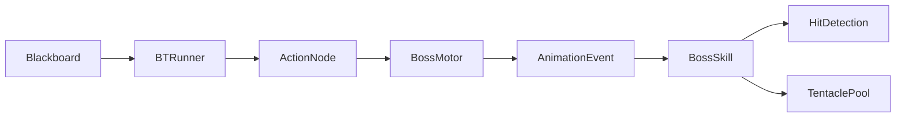

# Gameplay Systems Index

[← 저장소 홈](../README.md) · [코드 리뷰 가이드](../docs/REVIEW_GUIDE.md) · [전체 아키텍처](../docs/ARCHITECTURE.md) · [의존성 경계](../docs/DEPENDENCIES.md)

이 폴더에는 원본 Unity 프로젝트에서 선별한 세 Gameplay System이 독립적인 코드 리뷰 단위로 정리되어 있습니다.

## 추천 읽기 순서

| 순서 | 시스템 | 가장 잘 보여 주는 역량 | 시스템 문서 | Source Map |
|---:|---|---|---|---|
| 1 | Runtime Building System | 문제 재정의, State/Service 책임 분리, Graph와 BFS, Transaction/Rollback | [README](./RuntimeBuildingSystem/README.md) | [Source](./RuntimeBuildingSystem/Source/README.md) |
| 2 | Behavior Tree + Utility AI | Runtime Node 수명주기, Abort, Stateful/Reactive 차이, 점수 기반 선택 | [README](./BehaviorTreeUtilityAI/README.md) | [Source](./BehaviorTreeUtilityAI/Source/README.md) |
| 3 | Boss Combat Framework | 연속 충돌 검사, Animation Event 기반 Skill, Pooling Cleanup | [README](./BossCombatFramework/README.md) | [Source](./BossCombatFramework/Source/README.md) |

## 시스템별 한 줄 구조

### Runtime Building System

```text
BuildingSystem
→ State
→ Preview Query
→ Placement / Removal Service
→ Structural Integrity / Inventory / World Commit
```

핵심 질문은 **“현재 상태에서 계산된 파생값을 구조 변경 후에도 그대로 신뢰할 수 있는가?”**입니다.

### Behavior Tree + Utility AI

```text
ScriptableObject Data
→ Runtime Node Graph
→ BTRunner Tick
↔ BlackBoard
→ Action Node
→ Motor / Animation Mode
```

핵심 질문은 **“실행 중인 행동을 누가 시작하고, 중단하고, 외부 상태를 원상복구하는가?”**입니다.

### Boss Combat Framework

```text
BT Action
→ Animation Mode
→ Animation Event
→ Skill Stage
→ Sweep / Grab / Tentacle
→ Cleanup / Pool Return
```

핵심 질문은 **“빠른 공격의 누락과 취소·재사용 과정의 잔존 상태를 어떻게 막는가?”**입니다.

## 시스템 간 연결

Behavior Tree와 Boss Combat Framework는 원본 Project에서 연결됩니다.



공개본에는 연결 경계의 일부 Base Class, Motor, Manager와 Package가 포함되지 않습니다. 자세한 내용은 [Dependency Map](../docs/DEPENDENCIES.md)을 참고하십시오.

## 다음 문서

- 전체를 빠르게 검토하려면 [Code Review Guide](../docs/REVIEW_GUIDE.md)
- 클래스 관계와 데이터 흐름을 보려면 [Architecture Notes](../docs/ARCHITECTURE.md)
- Compile되지 않는 참조의 역할을 보려면 [Dependency Map](../docs/DEPENDENCIES.md)
