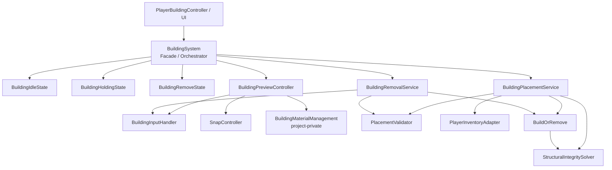
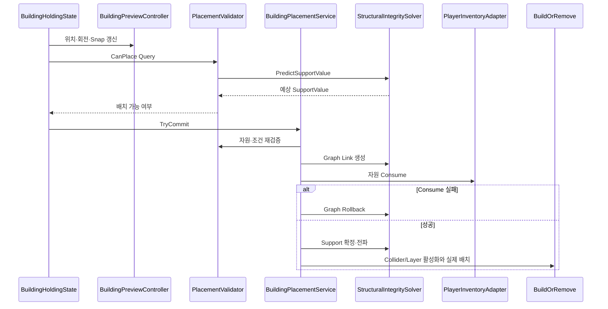
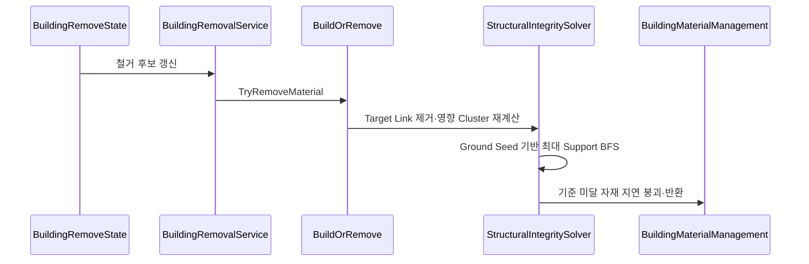

# Runtime Building System

[← 시스템 목록](../README.md) · [저장소 홈](../../README.md) · [Source Map](./Source/README.md) · [Review Guide](../../docs/REVIEW_GUIDE.md) · [Architecture](../../docs/ARCHITECTURE.md) · [Dependencies](../../docs/DEPENDENCIES.md) · [다음: Behavior Tree →](../BehaviorTreeUtilityAI/README.md)

런타임에서 건축 자재를 선택하고, 자동·수동·임시 자유 Snap으로 Preview 위치를 결정한 뒤, 자원·배치 범위·수면·예측 지지력을 검증해 설치하거나 철거하는 시스템입니다.

## 이 시스템에서 해결한 핵심 문제

### 1. Preview와 실제 상태 변경의 분리

Preview는 여러 위치를 매 Frame 시험합니다. 이 단계에서 실제 `Parents`·`ConnectedChildren`, Inventory, Collider/Layer를 수정하면 Preview를 움직이는 것만으로 World 상태가 오염됩니다.

```text
Preview Query
- 위치·회전·Snap 계산
- 거리·수면·자원·예측 지지력 검사
- Highlight만 갱신
             ↓ Place 입력
Commit
- 자원 재검증
- Graph Link 생성
- 실패 시 Rollback
- SupportValue 확정·전파
- 자원·내구도 소모
- Collider/Layer와 World 배치 반영
```

### 2. 철거 후 지지력 값의 의미 재정의

`SupportValue`는 자재 자체의 고정 속성이 아니라 다음 상태에서 파생된 값입니다.

```text
SupportValue
= 현재 연결 Graph
+ 지면까지 도달 가능한 경로
+ 경로별 감쇠율
```

연결 구조가 바뀌면 저장된 값의 근거가 사라질 수 있으므로, 철거 시 이전 값을 부분 보정하지 않습니다.

```text
Target Graph Link 제거
→ 주변 연결 Component 수집
→ Cluster의 SupportValue = 0
→ Ground Node를 Multi-source Seed로 등록
→ 더 높은 지지 경로만 BFS 전파
→ 기준 미달 Node를 Collapse Queue에 등록
```

### 3. Orchestrator와 세부 책임 분리

`BuildingSystem`은 외부 API와 상태 전환을 조율하고, 세부 작업은 Runtime Service와 Component에 위임합니다.



---

## 먼저 볼 파일

| 순서 | 파일 | 확인할 내용 |
|---:|---|---|
| 1 | [`BuildingSystem.cs`](./Source/Core/BuildingSystem.cs) | State 생성·전환, 의존성 초기화, Runtime Service 생성, 외부 API |
| 2 | [`BuildingHoldingState.cs`](./Source/States/BuildingHoldingState.cs) | 입력 처리와 Preview/검증/Commit 호출 순서 |
| 3 | [`PlacementValidator.cs`](./Source/Placement/PlacementValidator.cs) | 실제 Graph를 변경하지 않는 Preview Query와 Cache |
| 4 | [`BuildingPlacementService.cs`](./Source/Placement/BuildingPlacementService.cs) | Graph·Inventory Transaction, Rollback, World Commit |
| 5 | [`StructuralIntegritySolver.cs`](./Source/StructuralIntegrity/StructuralIntegritySolver.cs) | 예측, Graph 연결, Cluster 수집, Multi-source BFS, Collapse |
| 6 | [`BuildingRemovalService.cs`](./Source/Placement/BuildingRemovalService.cs) | Collider에서 Material Root를 해석하고 성공 후에만 후처리 |

5분만 검토한다면 **1 → 3 → 4 → 5** 순서로 읽는 것이 가장 효율적입니다.

---

## 설치 실행 흐름



## 철거 실행 흐름



---

## 주요 설계 선택

| 선택 | 이유 |
|---|---|
| State가 `BuildingSystem` 공개 메서드만 호출 | 상태 구현이 내부 Component와 강하게 결합되는 것을 줄임 |
| Preview Root는 판정 위치에 즉시 이동, Visual만 보간 | 화면 부드러움 때문에 물리 판정 위치가 뒤처지는 문제 방지 |
| `PlacementValidator` 결과 Cache | 같은 Pivot·회전·대상에서 중복 Physics Query 감소 |
| `OverlapSphereNonAlloc`과 Buffer 재사용 | 반복 Preview·Graph 연결 검사에서 GC Allocation 감소 |
| 영향 Cluster만 재계산 | 철거할 때 전체 World를 순회하지 않음 |
| 더 높은 Support만 Queue에 재등록 | 여러 경로 중 최댓값을 남기고 불필요한 재방문 억제 |
| Inventory Adapter | 건축 System이 구체 Inventory 구현을 직접 알지 않도록 분리 |
| Commit 실패 시 Graph Rollback | 일부 상태만 반영된 불완전 배치 방지 |

---

## Source 폴더 지도

| 폴더 | 책임 |
|---|---|
| [`Source/Core`](./Source/Core/) | 외부 진입점과 상태·Service Orchestration |
| [`Source/States`](./Source/States/) | Idle/Holding/Remove 상태의 입력 흐름 |
| [`Source/Placement`](./Source/Placement/) | Input, Preview, Snap, Validation, Commit, Removal |
| [`Source/StructuralIntegrity`](./Source/StructuralIntegrity/) | 연결 Graph와 Support 계산 |
| [`Source/BuildingMaterials`](./Source/BuildingMaterials/) | Material 계약과 공통 구현 |
| [`Source/Inventory`](./Source/Inventory/) | Inventory 추상화와 호환 Adapter |
| [`Source/Data`](./Source/Data/) | Building ScriptableObject Data |

파일별 역할은 [`Source/README.md`](./Source/README.md)에 정리되어 있습니다.

---

## 공개본 경계

다음 구현은 원본 Project 또는 외부 Package에 남아 있습니다.

- `BuildingMaterialManagement`
- `BuildingColliderUtility`
- `PartialNavMeshBuilder`
- `RuntimeCursorController`
- `PlayerBuildingController`
- `Door`, `Boat`
- Malbers Inventory·Mode·Event
- KWS Water System
- URP `DecalProjector`

이 저장소에서 검토할 핵심은 외부 구현 자체가 아니라, 외부 기능을 `Adapter`, `Service`, `Manager` 경계로 연결한 방식입니다. 전체 목록은 [Dependency Map](../../docs/DEPENDENCIES.md)을 참고하십시오.

---

[Source Map으로 이동](./Source/README.md) · [다음 시스템: Behavior Tree + Utility AI →](../BehaviorTreeUtilityAI/README.md)
