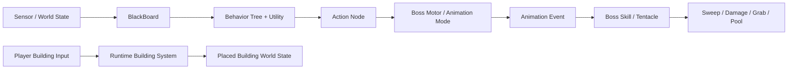

# Unity Gameplay Code Samples

<p align="center">
  <b>3D 오픈월드 액션 RPG에서 직접 설계·구현한 Unity Gameplay System 코드 리뷰 저장소</b>
</p>

<p align="center">
  
  
  
  
</p>

> **상태:** 개발 진행 중 · 부분 공개 소스 스냅샷 · 코드 리뷰용 저장소

이 저장소는 개발 중인 **3D 오픈월드 액션 RPG**에서 직접 설계하고 구현한 Unity C# 코드 중, 설계 판단과 문제 해결 과정을 보여 주는 세 시스템을 선별해 공개한 포트폴리오 저장소입니다.

전체 Unity 프로젝트를 배포하는 저장소는 아닙니다. Scene, Prefab, ScriptableObject Asset, Art·Sound Resource, 프로젝트 설정, 외부 유료 패키지와 일부 프로젝트 전용 통합 코드는 포함하지 않았습니다. 따라서 이 저장소만으로 독립 실행이나 전체 Compile을 재현하는 것이 아니라, **책임 분리·상태 관리·그래프 알고리즘·수명주기·물리 Query 설계**를 검토하는 것을 목적으로 합니다.

---

## 처음 보는 검토자를 위한 시작점

| 검토 시간 | 추천 경로 |
|---|---|
| 약 3분 | 아래 **세 시스템 요약**과 각 시스템의 `먼저 볼 파일` 확인 |
| 약 10분 | [`docs/REVIEW_GUIDE.md`](./docs/REVIEW_GUIDE.md)의 10분 검토 경로 |
| 약 20~30분 | 관심 시스템 README → Source Map → 대표 구현 파일 순서 |
| 전체 구조 확인 | [`docs/ARCHITECTURE.md`](./docs/ARCHITECTURE.md) |
| 공개본 경계 확인 | [`docs/DEPENDENCIES.md`](./docs/DEPENDENCIES.md) |

전체 시스템 목록은 [`Code_Samples/README.md`](./Code_Samples/README.md)에 정리되어 있습니다.

---

## 공개한 핵심 시스템

### 1. Runtime Building System — 대표 프로젝트

런타임 건축물의 선택·Preview·Snap·배치·철거와 구조 안정성을 하나의 흐름으로 연결한 시스템입니다.

| 문제 | 핵심 판단 |
|---|---|
| Preview 검사 중 실제 World 상태가 오염되는 문제 | **Query와 Commit을 분리**하고 클릭 후에만 그래프·자원·World 상태 변경 |
| 철거 후 저장된 지지력이 더 이상 유효하지 않은 문제 | `SupportValue`를 고정값이 아닌 **현재 그래프에서 파생된 값**으로 정의하고 영향 Cluster만 무효화·재계산 |
| 입력·Preview·검증·설치 책임이 한 클래스에 집중되는 문제 | State와 `PreviewController`, `PlacementService`, `RemovalService`로 실행 책임 분리 |
| 전체 건축물을 다시 계산할 때 발생하는 비용 | 철거 지점 주변의 연결 Component만 BFS로 수집해 국소 재계산 |

**먼저 볼 파일**

1. [`BuildingSystem.cs`](./Code_Samples/RuntimeBuildingSystem/Source/Core/BuildingSystem.cs)
2. [`PlacementValidator.cs`](./Code_Samples/RuntimeBuildingSystem/Source/Placement/PlacementValidator.cs)
3. [`BuildingPlacementService.cs`](./Code_Samples/RuntimeBuildingSystem/Source/Placement/BuildingPlacementService.cs)
4. [`StructuralIntegritySolver.cs`](./Code_Samples/RuntimeBuildingSystem/Source/StructuralIntegrity/StructuralIntegritySolver.cs)

[시스템 설명](./Code_Samples/RuntimeBuildingSystem/README.md) · [Source Map](./Code_Samples/RuntimeBuildingSystem/Source/README.md)

---

### 2. Custom Behavior Tree + Utility AI

조건과 실행 순서를 표현하는 Behavior Tree에 상황별 점수 선택을 결합한 Boss AI 런타임입니다.

| 문제 | 핵심 판단 |
|---|---|
| 행동이 중단되어도 이동·Mode·Coroutine 상태가 남는 문제 | 모든 Node에 `Start / Update / Stop / Abort` 수명주기 부여 |
| 순차 행동과 즉시 조건 재검사가 같은 방식으로 동작하는 문제 | Stateful `Sequence`와 `ReactiveSequence`를 분리 |
| 점수가 조금 변할 때마다 행동이 교체되는 문제 | 재평가 주기, `CanInterrupt()`, 관성 Bonus로 전환 안정화 |
| Editor 데이터와 Runtime 상태가 섞이는 문제 | ScriptableObject Node Data와 Runtime Node Instance 분리 |

**먼저 볼 파일**

1. [`Node.cs`](./Code_Samples/BehaviorTreeUtilityAI/Source/Core/Node.cs)
2. [`BTRunner.cs`](./Code_Samples/BehaviorTreeUtilityAI/Source/Core/BTRunner.cs)
3. [`UtilitySelectorNode.cs`](./Code_Samples/BehaviorTreeUtilityAI/Source/Composite/UtilitySelectorNode.cs)
4. [`ActionJumpAttackNode.cs`](./Code_Samples/BehaviorTreeUtilityAI/Source/ExampleActions/ActionJumpAttackNode.cs)

[시스템 설명](./Code_Samples/BehaviorTreeUtilityAI/README.md) · [Source Map](./Code_Samples/BehaviorTreeUtilityAI/Source/README.md)

---

### 3. Boss Combat Framework

빠른 골격 공격의 피격 누락, 다단계 Skill 취소, Pooling된 촉수의 상태 초기화를 다루는 보스 전투 코드입니다.

| 문제 | 핵심 판단 |
|---|---|
| 빠른 공격이 Frame 사이를 통과해 피격이 누락되는 문제 | 이전→현재 위치 `SphereCast`로 시간축 궤적 검사 |
| 긴 공격 Segment 사이에 빈 판정 공간이 생기는 문제 | 인접 Segment를 `OverlapCapsule`로 연결 |
| 같은 공격 창에서 중복 피해가 발생하는 문제 | 공격 창 단위 `HashSet<Collider>`로 중복 처리 방지 |
| Pool 재사용 후 HP·Animator·Controller·Coroutine 상태가 남는 문제 | `OnEnable / OnDisable`에서 상태·Listener·Coroutine 명시적 초기화 |
| Phase 전환 중 이전 행동과 Skill이 계속 실행되는 문제 | BT Abort와 Skill Cleanup을 Phase 전환 경로에 연결 |

**먼저 볼 파일**

1. [`BossSweepDamager.cs`](./Code_Samples/BossCombatFramework/Source/HitDetection/BossSweepDamager.cs)
2. [`TenTacleChild.cs`](./Code_Samples/BossCombatFramework/Source/Tentacle/TenTacleChild.cs)
3. [`TreeStrikeYC.cs`](./Code_Samples/BossCombatFramework/Source/Skills/TreeStrikeYC.cs)
4. [`YeogChunPhaseManager.cs`](./Code_Samples/BossCombatFramework/Source/Phase/YeogChunPhaseManager.cs)

[시스템 설명](./Code_Samples/BossCombatFramework/README.md) · [Source Map](./Code_Samples/BossCombatFramework/Source/README.md)

---

## 시스템 관계

세 폴더는 검토하기 쉽게 분리되어 있지만, 원본 게임에서는 다음 책임 경계로 연결됩니다.



- **Behavior Tree**는 무엇을 할지 선택합니다.
- **Boss Combat Framework**는 선택된 행동을 Animation Event와 Skill 단계로 실행합니다.
- **Runtime Building System**은 별도의 Player Gameplay System으로 Preview Query와 실제 World Commit을 관리합니다.

---

## 역량별 코드 진입점

| 확인하고 싶은 역량 | 추천 파일 |
|---|---|
| Facade와 State 기반 실행 조율 | [`BuildingSystem.cs`](./Code_Samples/RuntimeBuildingSystem/Source/Core/BuildingSystem.cs) |
| Query / Command 경계 | [`PlacementValidator.cs`](./Code_Samples/RuntimeBuildingSystem/Source/Placement/PlacementValidator.cs), [`BuildingPlacementService.cs`](./Code_Samples/RuntimeBuildingSystem/Source/Placement/BuildingPlacementService.cs) |
| 그래프 무효화와 BFS 재계산 | [`StructuralIntegritySolver.cs`](./Code_Samples/RuntimeBuildingSystem/Source/StructuralIntegrity/StructuralIntegritySolver.cs) |
| 명시적 Node 수명주기와 Abort | [`Node.cs`](./Code_Samples/BehaviorTreeUtilityAI/Source/Core/Node.cs) |
| Utility 기반 행동 전환 안정화 | [`UtilitySelectorNode.cs`](./Code_Samples/BehaviorTreeUtilityAI/Source/Composite/UtilitySelectorNode.cs) |
| 복합 Action Cleanup | [`ActionJumpAttackNode.cs`](./Code_Samples/BehaviorTreeUtilityAI/Source/ExampleActions/ActionJumpAttackNode.cs) |
| 연속 물리 Query | [`BossSweepDamager.cs`](./Code_Samples/BossCombatFramework/Source/HitDetection/BossSweepDamager.cs) |
| Pooling 개체 수명주기 | [`TenTacleChild.cs`](./Code_Samples/BossCombatFramework/Source/Tentacle/TenTacleChild.cs) |
| 단계형 Skill과 취소 | [`TreeStrikeYC.cs`](./Code_Samples/BossCombatFramework/Source/Skills/TreeStrikeYC.cs) |

---

## 저장소 구조

```text
.
├─ README.md
├─ Code_Samples/
│  ├─ README.md
│  ├─ RuntimeBuildingSystem/
│  │  ├─ README.md
│  │  └─ Source/
│  │     ├─ README.md
│  │     ├─ Core/
│  │     ├─ States/
│  │     ├─ Placement/
│  │     ├─ StructuralIntegrity/
│  │     ├─ BuildingMaterials/
│  │     ├─ Inventory/
│  │     └─ Data/
│  ├─ BehaviorTreeUtilityAI/
│  │  ├─ README.md
│  │  └─ Source/
│  │     ├─ README.md
│  │     ├─ Core/
│  │     ├─ Composite/
│  │     ├─ Data/
│  │     ├─ Scoring/
│  │     └─ ExampleActions/
│  └─ BossCombatFramework/
│     ├─ README.md
│     └─ Source/
│        ├─ README.md
│        ├─ HitDetection/
│        ├─ Skills/
│        ├─ Tentacle/
│        ├─ Grabs/
│        └─ Phase/
└─ docs/
   ├─ README.md
   ├─ REVIEW_GUIDE.md
   ├─ ARCHITECTURE.md
   └─ DEPENDENCIES.md
```

---

## 문서

| 문서 | 내용 |
|---|---|
| [`Code_Samples/README.md`](./Code_Samples/README.md) | 세 시스템의 역할과 추천 읽기 순서 |
| [`docs/REVIEW_GUIDE.md`](./docs/REVIEW_GUIDE.md) | 검토 시간·관심 주제별 코드 경로 |
| [`docs/ARCHITECTURE.md`](./docs/ARCHITECTURE.md) | 호출 방향, 데이터 흐름, Query/Commit 경계 |
| [`docs/DEPENDENCIES.md`](./docs/DEPENDENCIES.md) | 공개본에 포함되지 않은 Unity Package와 프로젝트 전용 타입 |
| [`NOTICE.md`](./NOTICE.md) | 공개 범위와 외부 자산 고지 |
| [`LICENSE`](./LICENSE) | 소스 이용 조건 |

---

## 공개 범위

이 저장소에서 확인할 수 있는 것은 다음과 같습니다.

- 클래스 간 책임과 실제 호출 방향
- State와 Node의 수명주기
- Queue·Graph·HashSet 기반 알고리즘
- Preview Query와 World Commit의 분리
- NonAlloc Physics Query와 Buffer 재사용
- 외부 Package를 Adapter·Base·Manager 경계로 연결한 방식

전체 게임 Project, Scene/Prefab, 외부 Package, Art·Sound Asset, 프로젝트 전용 Manager 구현은 공개 범위에 포함되지 않습니다. 누락된 의존성은 오류가 아니라 코드 리뷰 스냅샷의 의도된 경계이며, 구체 목록은 [`docs/DEPENDENCIES.md`](./docs/DEPENDENCIES.md)에 정리되어 있습니다.
