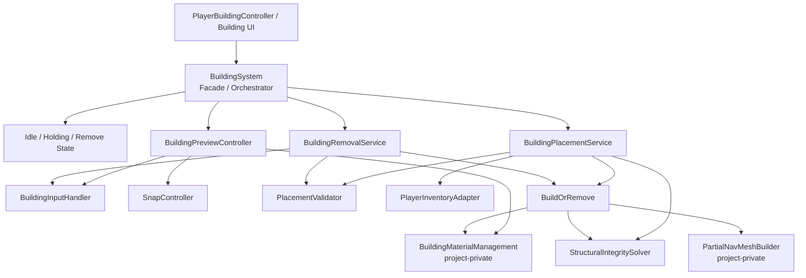
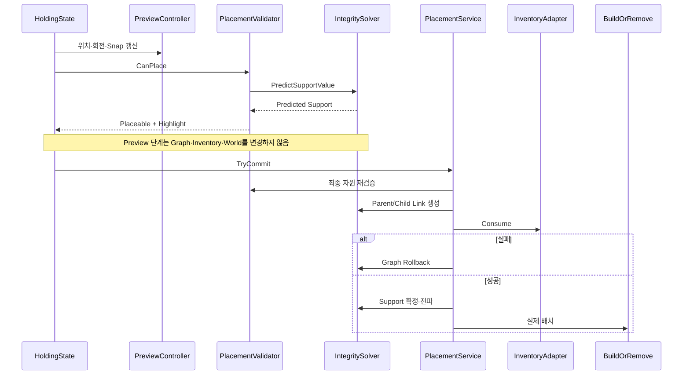
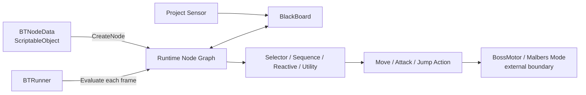
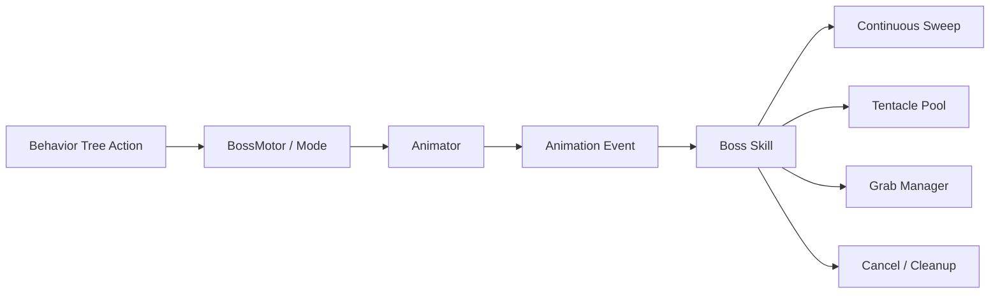
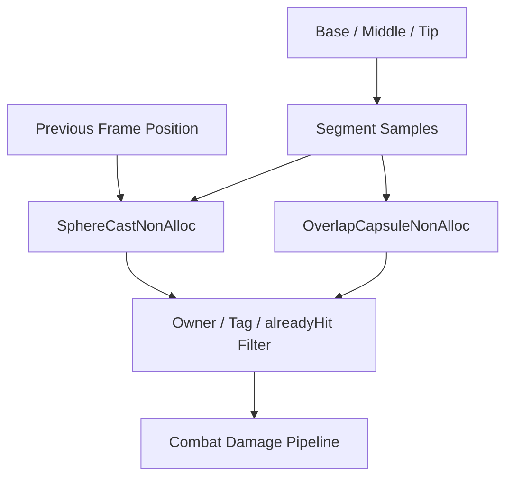

# Architecture Notes

[← 문서 목록](./README.md) · [저장소 홈](../README.md) · [시스템 목록](../Code_Samples/README.md) · [Review Guide](./REVIEW_GUIDE.md) · [Dependencies](./DEPENDENCIES.md)

## 1. Runtime Building System

[시스템 README](../Code_Samples/RuntimeBuildingSystem/README.md) · [Source Map](../Code_Samples/RuntimeBuildingSystem/Source/README.md)

### 책임 분리



`BuildingSystem`은 상태와 외부 API를 보유하지만 Preview 계산·배치 Transaction·철거 실행을 직접 구현하지 않습니다. `BuildingPreviewController`, `BuildingPlacementService`, `BuildingRemovalService`는 `BuildingSystem`이 생성해 사용하는 일반 C# Runtime Object입니다.

### Preview Query와 Commit



### 구조 안정성

각 `IMaterial`은 `Parents`, `ConnectedChildren`, `SupportValue`, Material Type, Anchor와 GameObject 참조를 제공합니다.

```text
철거 전
SupportValue = 현재 Graph의 유효한 경로에서 전달된 최대값

철거 후
1. Target Link 제거
2. Target 주변의 연결 Component 수집
3. Cluster SupportValue 초기화
4. Ground 접촉 Node를 Multi-source Seed로 등록
5. 더 높은 Support만 이웃에 전파
6. MinimumSupport 미달 Node를 Collapse Queue로 이동
```

이 방식은 저장된 Support의 출처 경로를 추적하지 않더라도 구조 변경 후 현재 Graph에 맞는 값을 다시 계산합니다.

---

## 2. Behavior Tree + Utility AI

[시스템 README](../Code_Samples/BehaviorTreeUtilityAI/README.md) · [Source Map](../Code_Samples/BehaviorTreeUtilityAI/Source/README.md)

### Data와 Runtime



- ScriptableObject는 Tree 정의를 보관합니다.
- Runtime Node는 `started`, Child Index, Active Node, Timer를 보관합니다.
- Blackboard는 Runtime Node 사이의 공유 Context입니다.
- Action은 외부 Controller에 명령을 요청하고 중단 시 Cleanup합니다.

### Node Lifecycle

```text
Evaluate
├─ 처음 실행: OnStart
├─ 매 Tick: OnUpdate
└─ SUCCESS / FAILURE: OnStop

Stop
├─ OnAbort
├─ OnStop
└─ started = false
```

### Utility 선택

```text
No Active Node
→ 모든 Entry Score 계산
→ 최대 Score Child 선택
→ Evaluate

Active Node
→ CanInterrupt가 true일 때 재평가 Timer 증가
→ Interval 경과 후 Score 재계산
→ 현재 Child에 inertiaBonus
→ 더 높은 다른 Child면 Active Stop 후 교체
```

---

## 3. Boss Combat Framework

[시스템 README](../Code_Samples/BossCombatFramework/README.md) · [Source Map](../Code_Samples/BossCombatFramework/Source/README.md)

### 행동 실행



### Continuous Sweep



- SphereCast는 시간 방향 이동 궤적을 채웁니다.
- Capsule Overlap은 공격 길이 방향 Segment 사이를 채웁니다.
- `HashSet<Collider>`는 같은 공격 창에서 동일 Collider의 중복 처리를 막습니다.

### Skill과 Pool Cleanup

```text
Animation Event
→ Skill Execute Stage
→ Spawn / Telegraph / Damage
→ 정상 완료 Cleanup

Phase 전환 또는 강제 취소
→ BT Abort
→ CancelSkill / AttackCleanUp
→ Coroutine·Mode·생성 Object 정리
```

```text
Tentacle OnEnable
→ Listener 등록
→ Delayed Reset

Attack / Death
→ ReturnToPool

Tentacle OnDisable
→ Listener 제거
→ Coroutine 중단
→ Busy/Spawn State 초기화
```

---

## 공통 설계 기준

| 기준 | 적용 사례 |
|---|---|
| Query와 Command를 구분 | Building Preview와 Placement Commit |
| 파생값의 유효 범위를 정의 | Structural Support 재계산 |
| 실행 상태의 소유자를 명확히 함 | Runtime BT Node, Boss Skill, Tentacle |
| 중단 경로를 정상 완료와 동일하게 설계 | Node Abort, Skill Cancel, Pool Disable |
| 반복 Query의 Allocation을 줄임 | NonAlloc Physics API와 Buffer 재사용 |
| 외부 Package를 경계 뒤에 둠 | Inventory Adapter, Boss Base/Motor, Manager |

[← 문서 목록](./README.md)
