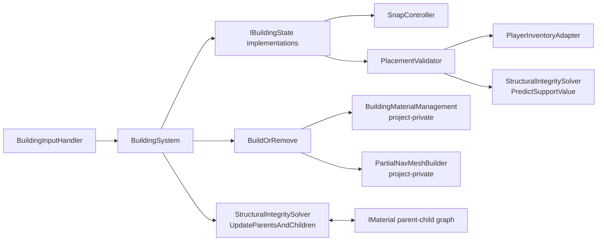
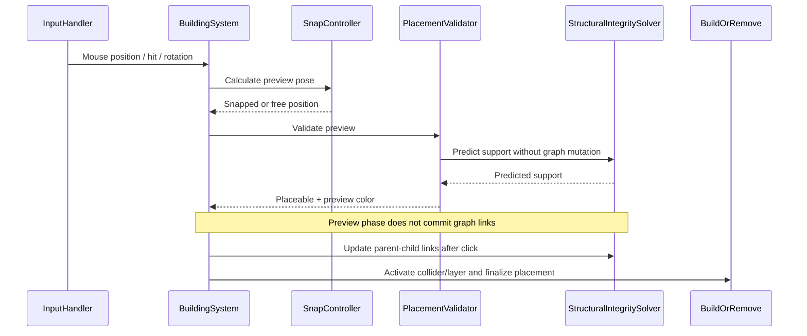
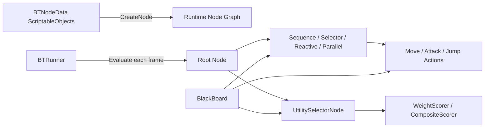
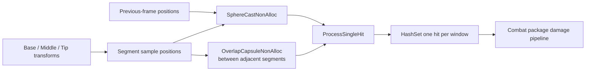
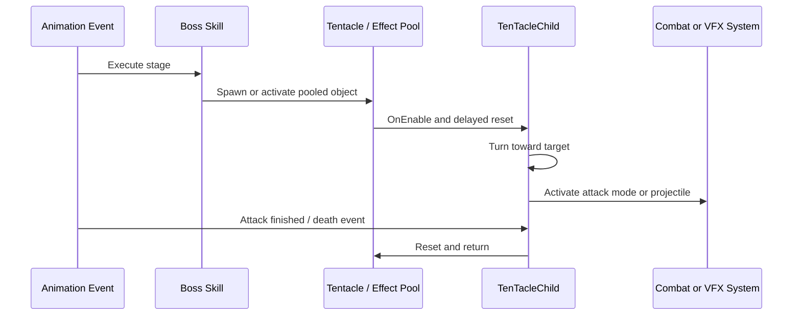

# Architecture Notes

## 1. Runtime Building System

### 책임 분리



`BuildingSystem`은 현재 건축 상태, 선택한 자재, 입력, 스냅 모드, 검증, 실제 설치/철거를 조정합니다. 개별 계산은 전용 컴포넌트로 위임합니다.

### 프리뷰와 Commit 분리



프리뷰 과정에서 실제 `Parents`/`ConnectedChildren` 목록을 수정하지 않습니다. 설치 클릭 후에만 연결 관계를 만들고 예측 결과를 확정합니다. 이 구분은 프리뷰 이동 중 그래프가 오염되거나, 철거·재계산 대상이 잘못 확장되는 문제를 줄입니다.

### 구조 안정성 모델

각 `IMaterial`은 다음 정보를 가집니다.

- `Parents`와 `ConnectedChildren`
- 현재 `SupportValue`
- 자재별 `MaxSupportWeight`
- 지면 접촉 여부
- 연결을 검색할 Anchor 목록

설치 시 지면 접촉 자재 또는 기존 이웃의 지지력에서 시작해 BFS로 값을 전파합니다. 전파값은 **현재 노드의 지지력 × 자재 종류별 감쇠율**이며, 기존 값보다 큰 경우에만 이웃을 다시 Queue에 넣습니다. 따라서 여러 경로 중 가장 강한 지지 경로가 남습니다.

철거 시에는 제거 대상 주변의 연결 컴포넌트만 수집합니다. 해당 클러스터의 값을 0으로 초기화한 뒤 지면 접촉 노드를 시작점으로 다시 BFS를 수행하고, 최소 지지력보다 낮은 자재를 지연 붕괴 Queue에 넣습니다. 공개 스냅샷의 기본 최소값은 `0.25f`이며 감쇠율은 기둥·암석·경사 기둥·일반 자재별로 조정됩니다.

### 성능 관련 선택

- `Physics.OverlapSphereNonAlloc`, `SphereCastNonAlloc`, `OverlapCapsuleNonAlloc` 사용
- 반복 호출되는 `Queue`, `List`, `HashSet`, Collider 배열 재사용
- 철거 시 전체 월드를 순회하지 않고 영향받는 연결 클러스터만 재계산
- 배치 검증 결과를 Pivot 위치·회전·모드 기준으로 캐시
- 판정 Root는 즉시 목표 위치로 이동시키고 Visual 자식만 보간

## 2. Custom Behavior Tree + Utility AI

### 데이터와 런타임 노드



에디터에서 구성한 `BTNodeData`가 실제 실행용 `Node` 인스턴스를 생성합니다. 데이터와 실행 상태를 분리했기 때문에 동일 데이터 구조를 유지하면서 런타임 노드의 `started`, 현재 자식, Timer 같은 상태를 개별 인스턴스가 가질 수 있습니다.

### 공통 생명주기

```text
Evaluate()
  ├─ first tick: OnStart()
  ├─ every tick: OnUpdate()
  └─ SUCCESS/FAILURE: OnStop() and reset started

Stop()
  ├─ OnAbort()
  ├─ OnStop()
  └─ reset started
```

명시적 Abort 경로가 있어 실행 중이던 이동 Agent, 애니메이션 Mode, Coroutine, Root Motion 배율 등을 정리할 수 있습니다.

### Stateful와 Reactive의 구분

- `Sequence`는 `currentChildIndex`를 유지해 실행 중인 단계부터 이어갑니다.
- `ReactiveSequenceNode`는 매 Tick 첫 자식부터 평가하므로 앞선 조건이 바뀌면 즉시 현재 행동을 중단할 수 있습니다.
- `Selector`는 더 높은 우선순위 자식이 실행되면 기존 `activeNode`를 `Stop()`합니다.
- `Parallel`은 주요 자식의 결과를 따르거나 모든 자식이 종료될 때까지 Join하는 정책을 제공합니다.

### Utility 전환 안정화

`UtilitySelectorNode`는 각 행동의 점수를 계산해 최댓값을 선택합니다. 실행 중인 행동이 `CanInterrupt()`를 허용할 때만 재평가 Timer가 증가하며, 현재 행동에는 `inertiaBonus`를 더합니다. 이 방식은 상황이 조금만 변해도 행동이 매 프레임 교체되는 Thrashing을 줄이면서, 충분히 큰 점수 변화에는 반응할 수 있게 합니다.

## 3. Boss Combat Framework

### 연속 Sweep Hit Detection



한 프레임의 현재 위치에 Collider만 두면 빠른 공격이 프레임 사이를 건너뛰어 피격이 누락될 수 있습니다. `BossSweepDamager`는 두 방향으로 빈 공간을 보완합니다.

1. 각 세그먼트의 이전 위치에서 현재 위치까지 SphereCast해 **시간 방향의 이동 궤적**을 채웁니다.
2. 현재 프레임의 인접 세그먼트 사이를 Capsule Overlap으로 검사해 **공격 길이 방향의 공간**을 채웁니다.

공격 창이 다시 활성화될 때 `alreadyHit`를 비우며, 같은 창 안에서는 동일 Collider에 한 번만 피해를 전달합니다.

### 스킬과 풀링 수명주기



촉수는 재사용되므로 단순히 GameObject를 다시 활성화하는 것만으로는 충분하지 않습니다. HP, Animator, Controller State, 공격 중 플래그, Coroutine, AI Spawn 상태를 명시적으로 초기화합니다. 스킬 클래스는 Telegraph, 지연, 발사, 장착, 피해, Cleanup을 애니메이션 이벤트 단위로 나눠 연출 타이밍과 Gameplay 판정을 연결합니다.
